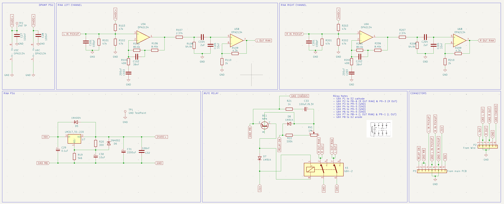

# RIAA Schematics for BeoGram 4002

This repository hosts a KiCad project for an open-source RIAA equalization circuit designed for use with the BeoGram 4002 turntable.

Currently, the project is a work in progress, serving as a prototype while I expand my understanding of audio circuits and operational amplifiers during development.

The design features a single-stage RIAA equalization circuit based on the OPA2134.

## Requirements

- Low noise.
- Plug'n'Play / Drop-in replacement.
- TBC.

## Roadmap

- Finish the schematics for the prototype.
- Finish the PCB design for the prototype.
-Test the RIAA with adequate equipment.

## Contributing

Contributions are welcome and much wanted! Whether you have suggestions for improvements, bug fixes, or additional features, feel free to submit a pull request.
## License

[GPL](https://choosealicense.com/licenses/gpl-3.0/)

## Authors

- [@Christian Leicht](https://www.github.com/leicht-io)

