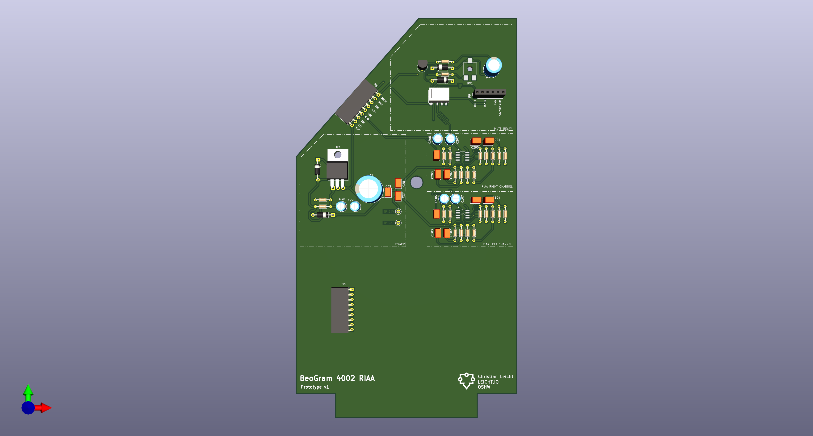

# BeoGram 4002 RIAA Preamp

[](https://github.com/leicht-io/BeoGram-4002-RIAA/actions/workflows/kicad.yml)
[](./LICENSE)
[](./LICENSE-DOCS)

An open-source RIAA phono preamplifier board for the Bang & Olufsen **BeoGram 4002 / 4004** turntable, designed in KiCad.



| | |
|---|---|
| **Status** | Prototype v2 (SMD) – manufactured and tested working |
| **Tool** | KiCad 10 (files are readable by KiCad 9) |
| **Board** | 2-layer, 1.6 mm, ~112 × 202 mm |
| **Hardware licence** | [CERN-OHL-S v2](./LICENSE) |
| **Docs licence** | [CC BY-SA 4.0](./LICENSE-DOCS) |

> This project is community driven. Build reports, measurements and design improvements are very welcome – see [CONTRIBUTING.md](./CONTRIBUTING.md).
> Questions and build help: [Discussions](https://github.com/leicht-io/BeoGram-4002-RIAA/discussions).

---

## Contents

- [Technical overview](#technical-overview)
- [Connectors](#connectors)
- [Getting the build files](#getting-the-build-files)
- [Building one](#building-one)
- [Known issues and roadmap](#known-issues-and-roadmap)
- [Repository layout](#repository-layout)
- [Contributing](#contributing)
- [Safety and disclaimer](#safety-and-disclaimer)
- [License](#license)

---

## Technical overview

A dual-stage active/passive RIAA equalizer per channel, based on the classic LM833 application topology but using the **OPA2134** for lower distortion. Full details are in [docs/design-notes.md](./docs/design-notes.md).

- **Stage 1 (U5A / U6A):** non-inverting gain stage that sets the 3180 µs / 318 µs part of the RIAA curve.
- **75 µs network:** passive RC between the stages.
- **Stage 2 (U5B / U6B):** flat gain of about 3.15×.
- **Gain:** about 34 dB at 1 kHz (calculated, not yet measured).
- **Power:** an LM317 makes about 24.6 V from the turntable's 30 V rail. The op-amps run from this single supply, biased at half the supply.
- **Mute relay:** an Omron G6K-2 shorts both outputs to ground until the turntable's `RELAY ON` signal has been present for a while. The delay is set with RV1, and the board mutes instantly when the signal drops.

## Connectors

**P8 – From main PCB** (2×9, 2.54 mm)

| Pin | Signal |
|---|---|
| 1, 2 | RELAY ON |
| 3, 4, 5, 6 | GND |
| 7, 8 | L IN (pickup) |
| 9, 10 | GND |
| 11, 12 | R IN (pickup) |
| 13, 14 | GND |
| 15, 16 | 21 V (relay supply) |
| 17, 18 | 30 V (preamp supply) |

**P10 – From Keyboard** (2×9, 2.54 mm). Power only; the other pins are not connected.

| Pin | Signal |
|---|---|
| 3, 4 | 30 V |
| 11, 12 | 21 V |
| 13, 14 | GND |

**P9 – Output** (1×6, 2.54 mm)

| Pin | Signal |
|---|---|
| 1 | L OUT |
| 3 | R OUT |
| 2, 4, 5, 6 | GND |

## Getting the build files

CI builds these files from the KiCad sources on every push, so they always match the design:

- **Releases:** every tagged version (`v*`) has a [GitHub release](https://github.com/leicht-io/BeoGram-4002-RIAA/releases) with a schematic PDF, the BOMs, the pick-and-place file and renders.
- **Latest `main` / any PR:** open the latest [KiCad workflow run](https://github.com/leicht-io/BeoGram-4002-RIAA/actions/workflows/kicad.yml) and download the `outputs` artifact (you must be logged in to GitHub).

The CI produces two BOMs:

| File | Contents |
|---|---|
| `RIAA-bom-full.csv` | Every part. The `Assembly` column says whether a part is assembled by JLCPCB or soldered by hand. |
| `RIAA-bom-jlcpcb.csv` + `RIAA-cpl-jlcpcb.csv` | Upload-ready files for JLCPCB SMT assembly. |

## Building one

1. Order the board with SMT assembly, using `RIAA-bom-jlcpcb.csv` and `RIAA-cpl-jlcpcb.csv`. Check the part rotations in JLCPCB's preview before confirming.
2. Hand-solder the parts marked `Hand` in `RIAA-bom-full.csv`: the film capacitors C101–C105 and C201–C205, and C103/C203.
3. Set RV1 for the unmute delay you want.
4. Install it in the turntable. *An illustrated installation guide is still missing – contributions are very welcome.*

Please post a **Build report** issue when you have built one, whether it worked or not.

## Known issues and roadmap

- [ ] **Input load is ~23.5 kΩ, not 47 kΩ.** The cartridge sees the two 47 k bias resistors in parallel. B&O MMC cartridges are specified for 47 kΩ.
- [ ] **All grounds are merged into a single GND net** (chassis, main board, pickup and output). Look at this first if hum shows up.
- [ ] **C104 / C204 (2 µF film) have no part number.**
- [ ] **ERC is not clean:** unused pins need no-connect flags and the supply nets need PWR_FLAGs.
- [ ] **No measurements yet:** RIAA deviation, noise and THD are still missing.
- [ ] **No installation guide or photos yet.**

## Repository layout

```
RIAA.kicad_pro / .kicad_sch / .kicad_pcb   KiCad project
parts/                                     Project-local footprints (OPA2134 D8)
3d-parts/                                  STL files for the 3D-printed board guides
docs/                                      Design notes
images/                                    Renders and photos
scripts/make_bom.py                        Builds the full and JLCPCB BOMs (used by CI)
.github/                                   CI workflow, issue and PR templates
```

## Contributing

See [CONTRIBUTING.md](./CONTRIBUTING.md). In short: open an issue or discussion first for design changes, keep each PR focused, and include screenshots of what you changed in the schematic or PCB.

## Safety and disclaimer

This board connects to the turntable's internal 30 V supply. Vintage equipment can be damaged by wiring mistakes. Everything here is provided **as is, without any warranty** (see the licence), and you build and install it at your own risk.

Bang & Olufsen, BeoGram and related names are trademarks of their owners. This project is not affiliated with or endorsed by Bang & Olufsen.

## License

- **Hardware design files** (KiCad, STL): [CERN Open Hardware Licence v2 – Strongly Reciprocal](./LICENSE) (CERN-OHL-S-2.0)
- **Documentation and images:** [Creative Commons Attribution-ShareAlike 4.0](./LICENSE-DOCS) (CC-BY-SA-4.0)
- **Scripts** (`scripts/`): GPL-3.0-or-later

## Author

Christian Leicht – [leicht.io](https://github.com/leicht-io)
