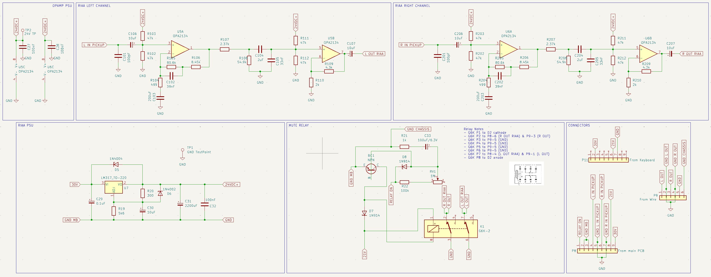

# BeoGram 4002 RIAA Preamp (SMD Prototype – Rev. 2)

This repository contains a **KiCad project** for an open-source RIAA equalization preamplifier designed specifically for the Bang & Olufsen BeoGram 4002 turntable.

The second prototype has now been manufactured in **SMD form and successfully tested**, confirming correct functionality and RIAA performance.

---

## Project Status

This project is still evolving. It began as a learning platform to deepen my understanding of:

- Audio circuit design
- RIAA equalization networks
- Operational amplifier behavior and stability
- Low-noise analog PCB layout techniques

While the current revision is fully working, further refinements and measurements will follow as the design matures.

---

## Technical Overview

The design is a **dual-stage active RIAA equalization circuit**, based on the classic LM833 topology but implemented using the **OPA2134** for improved audio performance and lower distortion.

### Key Features

- Dual-stage active RIAA network
- Low-noise audio op-amp (OPA2134)
- Designed for integration with the BeoGram 4002
- Compact SMD layout
- Power conditioning and mute relay support

---

## Images

---

## Contributing

Contributions are highly appreciated.

If you have suggestions for improvements, layout optimizations, measurement data, or alternative component choices, feel free to open an issue or submit a pull request.

---

## License

This project is licensed under the **GPL-3.0 License**.

See: https://choosealicense.com/licenses/gpl-3.0/

---

## Author

Christian Leicht  
https://github.com/leicht-io