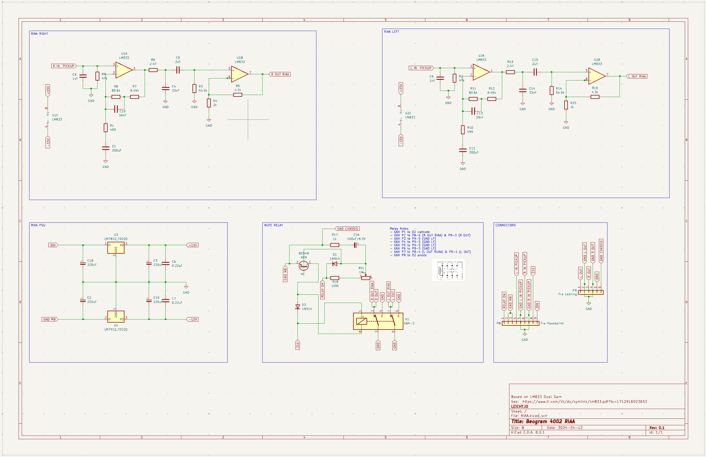

# RIAA Schematics for Beogram 4002

This repository contains a KiCad project for an open-source RIAA equalization circuit to be used in the Beogram 4002 turntable.

The project is, for now, a prototype in progress since I need to gain knowledge about audio circuits and operational amplifiers while developing it.

The RIAA is based on a two-stage RIAA using the [LM833](https://www.ti.com/lit/ds/symlink/lm833.pdf?ts=1713462514880) which should greatly improve the performance over a singleamplifier design.

## Requirements

- Two-stage gain.
- Low noise.
- Plug'n'Play / Drop-in replacement.
- ...

## Roadmap

- Finish the schematics for the prototype.
- Finish the PCB design for the prototype.
-Test the RIAA with adequate equipment.
- ...

## Contributing

Contributions are welcome and much wanted! Whether you have suggestions for improvements, bug fixes, or additional features, feel free to submit a pull request.
## License

[GPL](https://choosealicense.com/licenses/gpl-3.0/)

## Authors

- [@Christian Leicht](https://www.github.com/leicht-io)

